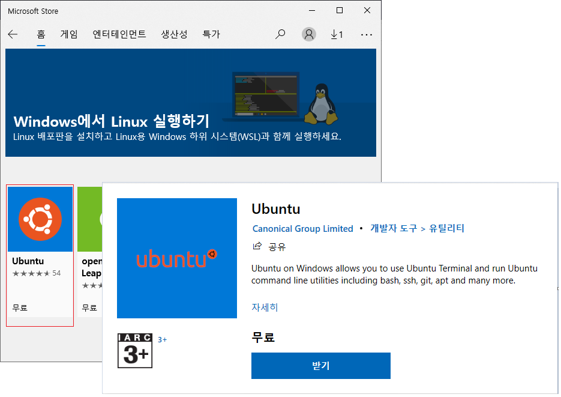
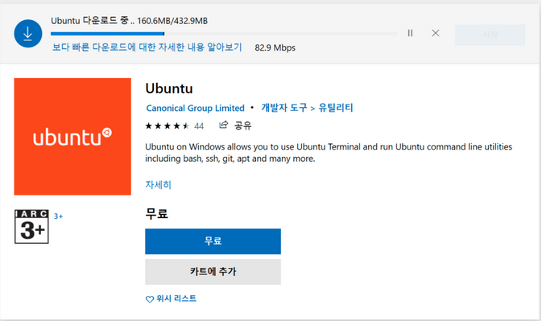
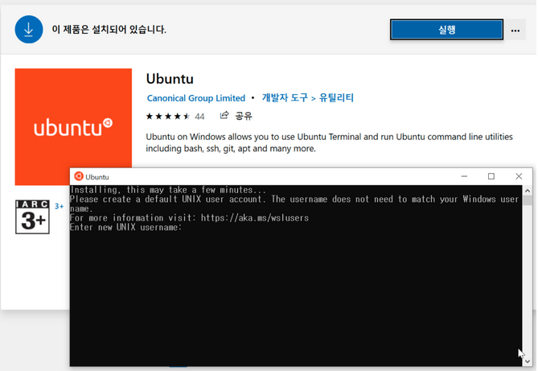
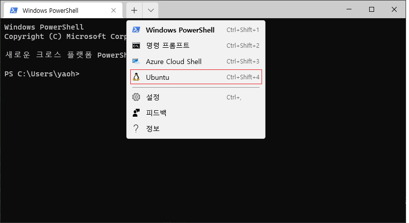

# Window Subsystem Linux
WSL를 이용하여 원도우즈에서 Linux를 사용할수 있습니다.
다음은 WSL2를 사용하여 windows에서 Ubutu를 사용하는 방법을 설명합니다.

## 요구 사항 확인

* Windows 버전 2004 이상, 빌드 19041 이상

## WSL 기능 활성화
powershell을 관리자 모드로 실행 후에 다음 명령을 실행합니다.

```powershell
dism.exe /online /enable-feature /featurename:Microsoft-Windows-Subsystem-Linux /all /norestart
```
> wsl 명령어를 실행하기 위해서는 재부팅이 필요합니다.

## Ubuntu 설치
[windows store](https://aka.ms/wslstore)로 Ubuntu를 선택합니다.



* 받기를 선택하여 우분투를 다운로드 합니다.



* 시작을 눌러서 터미널에서 설치가 진행되며 후에 ubuntu의 사용자 이름과 패스워드를 
입력합니다.




## WSL2로 업데이트
현재까지는 WSL 기능을 활성화 한것이고 최신 WSL2를 사용하기 위해서는
다음과 같이 추가 구성요소 및 업데이트 작업이 필요합니다.

### 가상 머신 플랫폼 구성 요소 사용
powershell을 관리자 모드로 실행 후에 다음 명령을 실행한 후에 시스템을 **재시작**합니다.

```powershell
dism.exe /online /enable-feature /featurename:VirtualMachinePlatform /all /norestart
```

### Linux 커널 업데이트 패키지 설치
WSL2를 사용하기 위해서는 WSL2용 Linux 커널 업데이트가 필요합니다.
요구사항에 확인한 시스템 유형에 따라서 다음에 선택하여 설치합니다.

- [x64용 Linux 커널 업데이트 패키지](https://wslstorestorage.blob.core.windows.net/wslblob/wsl_update_x64.msi)


### WSL2 를 기본 버전으로 설정

* 현재 실행중은 WSL 버전 확인

```console
>wsl -l -v
  NAME            STATE           VERSION
* Ubuntu-18.04    Stopped         1
```

* WSL Version 2로 변경

```console
>wsl --set-version Ubuntu-18.04 2
```

* WSL Version 2 확인

```console
>wsl -l -v
  NAME            STATE           VERSION
* Ubuntu-18.04    Stopped         2
```

## windows 터미널에서 wsl 실행

windows 터미널에서 새 탭옆에 버튼을 누르면 다음과같은 ubuntu shell이 활성화된 것을 확인할 수 있습니다.



ubuntu shell을 선택하여 shell을 활성화합니다.


## 참고

- [Windows 10에 WSL 설치](https://docs.microsoft.com/ko-kr/windows/wsl/install-win10)
- [How to install WSL2](https://pureinfotech.com/install-windows-subsystem-linux-2-windows-10)
- [WSL 1과 WSL 2 비교](https://docs.microsoft.com/ko-kr/windows/wsl/compare-versions)
