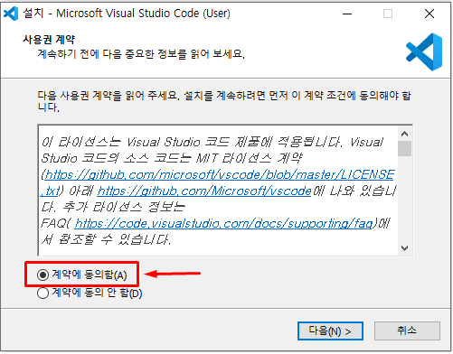

# Visual Studio Code 

## 설치
VS CODE는 다음과 같이 설치합니다.

* [VS Code Home](https://code.visualstudio.com/) 에서  설치파일을 다운로드 합니다.

* 설치파일을 실행합니다.

* 사용권 계약

* 설치 경로 확인

* 추가 작업 선택
 
 

* 설치 시작

 

* 설치 완료

 

## 단축키 정리

- *Ctrl +*: 화면 확대
- *Ctrl -*: 화면 축소

- *Ctrl f*: 파일 내 문자열 검색
- *Ctrl p*: 파일 검색

- *Ctrl b*: 사이드바 전환
- *Ctrl \\*: 편집창 나누기

## 테마

- [Material Theme](https://marketplace.visualstudio.com/items?itemName=Equinusocio.vsc-material-theme)
- [Material Icon Theme](https://marketplace.visualstudio.com/items?itemName=Equinusocio.vsc-material-theme)

## 세팅

## 참고
- [Shortcut](https://code.visualstudio.com/shortcuts/keyboard-shortcuts-windows.pdf)